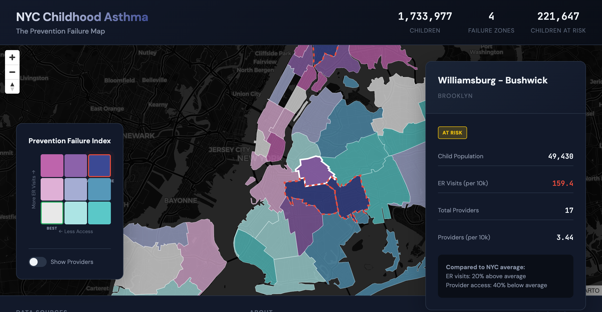

# NYC Childhood Asthma Prevention Failure Map

An interactive bivariate choropleth map revealing where New York City's healthcare system fails children with asthma—neighborhoods with high emergency room visit rates and low access to preventive specialists.



## Key Findings

### 4 Prevention Failure Zones Identified

These neighborhoods have the highest asthma ER rates AND the lowest access to pediatric pulmonologists and allergists:

| Neighborhood | Borough | ER Rate (per 10k) | Providers (per 10k) | Children |
|-------------|---------|-------------------|---------------------|----------|
| High Bridge - Morrisania | Bronx | 287.9 | 2.65 | 52,843 |
| Bedford Stuyvesant - Crown Heights | Brooklyn | 259.1 | 1.97 | 66,037 |
| East New York | Brooklyn | 215.1 | 0.39 | 51,016 |
| Northeast Bronx | Bronx | 180.2 | 1.63 | 61,269 |

**Total children in failure zones: 221,647** (12.8% of NYC's child population)

### Statistical Validation

- **ER rates are significantly higher** in failure zones (235.6 vs 122.3 per 10k, p=0.01)
- **Historical redlining predicts current asthma outcomes** (r=0.47, p=0.002)
- Failure zones are **68% more likely** to overlap with historically redlined areas

## Live Demo

[View the interactive map →](https://your-github-username.github.io/nyc-asthma-failure-map/)

## Data Sources

| Dataset | Source | Year |
|---------|--------|------|
| Asthma ED Visits | NYC DOHMH | 2023 |
| Healthcare Providers | CMS NPPES (NPI Registry) | 2024 |
| Child Population | US Census ACS 5-Year | 2022 |
| Geographic Boundaries | NYC DOHMH (UHF 42) | Current |
| Redlining Maps | Mapping Inequality (HOLC) | 1935-1940 |

## Quick Start

### Prerequisites
- Python 3.11+
- Conda (recommended) or pip

### Setup

```bash
# Clone the repository
git clone https://github.com/your-username/nyc-asthma-failure-map.git
cd nyc-asthma-failure-map

# Create conda environment
conda env create -f environment.yml
conda activate asthma-map

# Install package in development mode
pip install -e .
```

### Run the Pipeline

```bash
# Run all data processing scripts
make data

# Serve the web visualization locally
make web
# Visit http://localhost:8000
```

## Project Structure

```
nyc-asthma-failure-map/
├── data/
│   ├── raw/                  # Original data files
│   ├── processed/            # Intermediate outputs
│   ├── geo/                  # Geographic boundaries
│   └── final/                # Analysis outputs
├── scripts/
│   ├── 01_fetch_providers.py     # NPI Registry API
│   ├── 02_geocode_providers.py   # Census Geocoder
│   ├── 03_process_population.py  # Census ACS data
│   ├── 04_merge_datasets.py      # Combine all sources
│   ├── 05_calculate_classes.py   # Bivariate classification
│   ├── 06_export_for_web.py      # Web-ready GeoJSON
│   └── 07_validation.py          # Statistical tests
├── src/asthma_map/           # Core Python package
├── web/
│   ├── index.html            # Interactive map
│   ├── methodology.html      # Documentation
│   ├── css/style.css
│   ├── js/main.js
│   └── data/                 # Simplified GeoJSON
├── configs/params.yml        # Configuration
├── environment.yml           # Conda environment
└── Makefile                  # Pipeline orchestration
```

## Methodology

The visualization uses a **bivariate choropleth map**—a technique that shows two variables simultaneously using a 3×3 color grid:

- **X-axis**: Specialist access (providers per 10,000 children)
- **Y-axis**: ER visit rate (visits per 10,000 children)
- **Failure zones**: High ER + Low Access (deep blue, upper-right)

📄 **[Read the full methodology →](docs/METHODOLOGY.md)**

📊 **[See detailed findings →](docs/FINDINGS.md)**

## Reproducibility

This project follows strict reproducibility standards:

- All configuration in `configs/params.yml`
- Structured JSONL logging for pipeline traceability
- Atomic file writes with metadata sidecars
- Version-pinned dependencies
- Make-based pipeline orchestration

## License

MIT License - see [LICENSE](LICENSE) for details.

## Acknowledgments

- NYC Department of Health and Mental Hygiene for ER visit data
- CMS NPPES for provider registry
- US Census Bureau for population data
- [Mapping Inequality](https://dsl.richmond.edu/panorama/redlining/) for historical HOLC data
- [MapLibre GL JS](https://maplibre.org/) for web mapping
- [CARTO](https://carto.com/) for basemap tiles

---

**Note**: This analysis identifies structural patterns but does not imply causation. Provider location does not equal access—specialists may not accept Medicaid, have capacity, or be culturally accessible. See methodology for full limitations.
